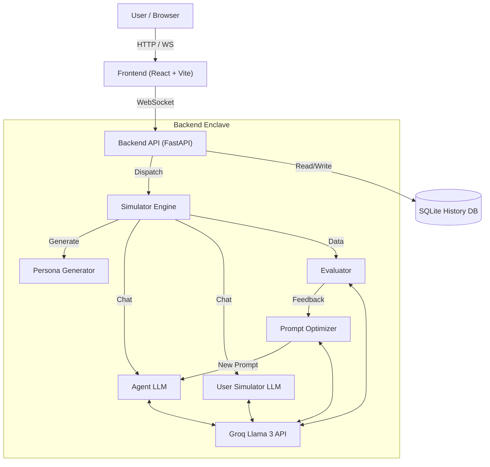

<div align="center">
  <h1>Odeon</h1>
  <h3>AI Agent Optimization Platform</h3>
  <p>Simulate, Evaluate, and Evolve AI Agents with Autonomous Feedback Loops.</p>

  [](LICENSE)
  [](https://www.python.org/)
  [](https://react.dev/)
  [](https://tailwindcss.com/)
  []()
  [](http://makeapullrequest.com)

  [](https://mapmyrepo.vasudev.live/?user=vasu-devs&repo=Odeon)
</div>

---

## 📖 Table of Contents

-   [Overview](#-overview)
-   [Key Features](#-key-features)
-   [System Architecture](#-system-architecture)
-   [Technology Stack](#-technology-stack)
-   [Quick Start](#-quick-start)
-   [Configuration](#-configuration)
-   [API Reference](#-api-reference)
-   [Roadmap](#-roadmap)
-   [Troubleshooting](#-troubleshooting)
-   [Contributing](#-contributing)
-   [License](#-license)
-   [Contact](#-contact)

---

## 🔭 Overview

**Odeon** is a cutting-edge playground for **AI Agent Engineering**. It solves the "black box" problem of prompt tuning by automating the evaluation loop. Instead of manually tweaking prompts and hoping for better results, Odeon:

1.  **Simulates** realistic user interactions (e.g., a stubborn debt defaulter).
2.  **Evaluates** the agent's performance against strict numerical KPIs (Empathy, Negotiation, Repetition).
3.  **Optimizes** the system prompt automatically using a meta-agent if targets are missed.

The result is a self-improving agent that converges on the optimal persona for your specific business goals.

---

## 🚀 Key Features

*   **⚡ Autonomous Optimization Loop**
    *   Generates diverse user personas (e.g., "The Lawyer", "The Crying Student").
    *   Runs high-fidelity simulations using **Groq** for near-instant inference.
    *   Rewrites prompts automatically based on granular feedback.

*   **📡 Real-Time Simulation Stream**
    *   Bi-directional **WebSocket** integration.
    *   Watch agent interactions unfold character-by-character.
    *   Live state tracking of current optimization cycles.

*   **🔄 Neural Visual Diffing**
    *   Git-style Red/Green diff viewer for Prompt Evolution.
    *   See exactly *which* words changed to improve empathy or compliance.

*   **🎨 Neo-Brutalist / Glassmorphism UI**
    *   A high-end, distraction-free interface built with **Tailwind CSS 4**.
    *   Dark mode focused "Deep Space" aesthetic.

*   **📊 Strict Metric Thresholds**
    *   Define pass/fail criteria (1-10) for **Repetition**, **Negotiation**, and **Empathy**.
    *   Agents must meet *all* criteria to "pass" a scenario.

*   **🗄️ SQLite History & Replay**
    *   Every run is archived. You can replay, analyze, and fork past simulations.

---

## 🏗️ System Architecture

Odeon uses a decoupled, event-driven architecture to handle high-concurrency simulations.



---

## 🛠️ Technology Stack

| Component | Tech | Description |
| :--- | :--- | :--- |
| **Backend** | Python 3.10+ | Core Application Logic |
| **API Framework** | FastAPI | Async, High-performance REST & WS |
| **AI Inference** | Groq Cloud | Llama 3.1-8b / 70b (Ultra-fast) |
| **Orchestration** | LangChain | Chain Management & Parsing |
| **Database** | SQLite | Lightweight embedded persistence |
| **Frontend** | React 19 | UI Library with Concurrent Mode |
| **Build Tool** | Vite | Instant HMR & bundling |
| **Styling** | Tailwind CSS 4 | Utility-first CSS engine |
| **Type Safety** | TypeScript | End-to-end typing |

---

## ⚡ Quick Start

### Prerequisites
-   **Python 3.10+**
-   **Node.js 18+** & `npm`
-   **Groq API Key** (Get it free at [console.groq.com](https://console.groq.com))

### 1. Clone & Install
```bash
git clone https://github.com/vasu-devs/odeon.git
cd odeon
```

### 2. Backend Setup
```bash
cd backend
python -m venv venv

# Activate Venv
source venv/bin/activate  # Mac/Linux
# venv\Scripts\activate   # Windows

pip install -r requirements.txt
```

### 3. Frontend Setup
```bash
cd ../frontend
npm install
```

---

## ⚙️ Configuration

Create a `.env` file in the `backend/` directory:

```ini
# Required: The engine power
GROQ_API_KEY=gsk_your_key_here

# Optional: For experimental multi-model support
GEMINI_API_KEY=your_gemini_key
```

### Running the App
**Terminal 1 (Backend):**
```bash
cd backend
# Make sure venv is active
python server.py
```

**Terminal 2 (Frontend):**
```bash
cd frontend
npm run dev
```

Visit `http://localhost:5173` to launch Odeon.

---

## 🔌 API Reference

### WebSocket Protocol (`/ws/simulate`)

**Request (Start Simulation):**
```json
{
  "api_key": "gsk_...",
  "model_name": "llama3-8b-8192",
  "base_prompt": "You are a specialized agent...",
  "thresholds": { "negotiation": 8.0, "empathy": 7.5 }
}
```

**Response (Events):**
-   `log`: Raw system output.
-   `result`: Final conversation metrics.
-   `optimization`: Diff of the prompt change.

---

## 🔮 Roadmap

-   [ ] **Multi-Agent Swarms**: Simulating group dynamics.
-   [ ] **Vector Memory**: Giving the agent long-term memory across runs.
-   [ ] **Cloud Deploy**: One-click deploy to Vercel/Railway.
-   [ ] **Custom Models**: Support for Anthropic/OpenAI via LiteLLM.
-   [ ] **Export Results**: PDF/CSV export for compliance reporting.

---

## ❓ Troubleshooting

**Q: I get a `401 Unauthorized` error from Groq.**
A: Check your `.env` file. Ensure `GROQ_API_KEY` is set correctly and has no trailing spaces.

**Q: The frontend shows "Disconnected".**
A: Ensure the backend is running on port `8000`. Check the terminal for any Python traceback errors.

**Q: Optimize Loop isn't updating the prompt.**
A: Ensure your "Overall" threshold isn't set too low. If the agent passes the low threshold, it won't optimize. Increase the target scores.

---

## 🤝 Contributing

Contributions are what make the open-source community such an amazing place to learn, inspire, and create. Any contributions you make are **greatly appreciated**.

1.  Fork the Project
2.  Create your Feature Branch (`git checkout -b feature/AmazingFeature`)
3.  Commit your Changes (`git commit -m 'Add some AmazingFeature'`)
4.  Push to the Branch (`git push origin feature/AmazingFeature`)
5.  Open a Pull Request

---

## 📄 License

Distributed under the MIT License. See `LICENSE` for more information.

---

## ✍️ Authors

*   **Vasudev Siddh** - *Initial Work* - [vasu-devs](https://github.com/vasu-devs)

<div align="center">
  <p>Built with ❤️ by the RiverLine Team</p>
</div>
